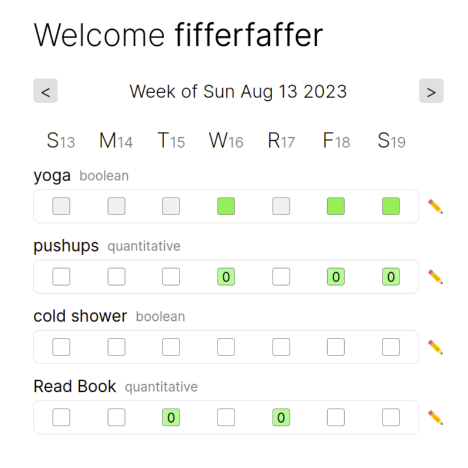

# Habits

A habit tracker.

Made with Next.js, flask and Postgres. 

East to host on a homeserver for access anywhere




# Migrations

To apply migrations locally:
- Set the `MIGRATE_MODE` environment variable to `True`
```shell
export MIGRATE_MODE=True
```

- Activate the virtual environment and make migrations
```shell
source env/bin/activate
flask db upgrade
```

- To undo the migration
```shell
flask db downgrade
```